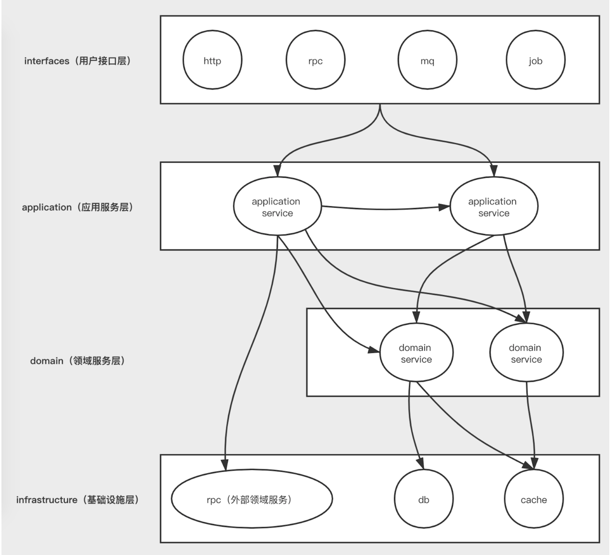
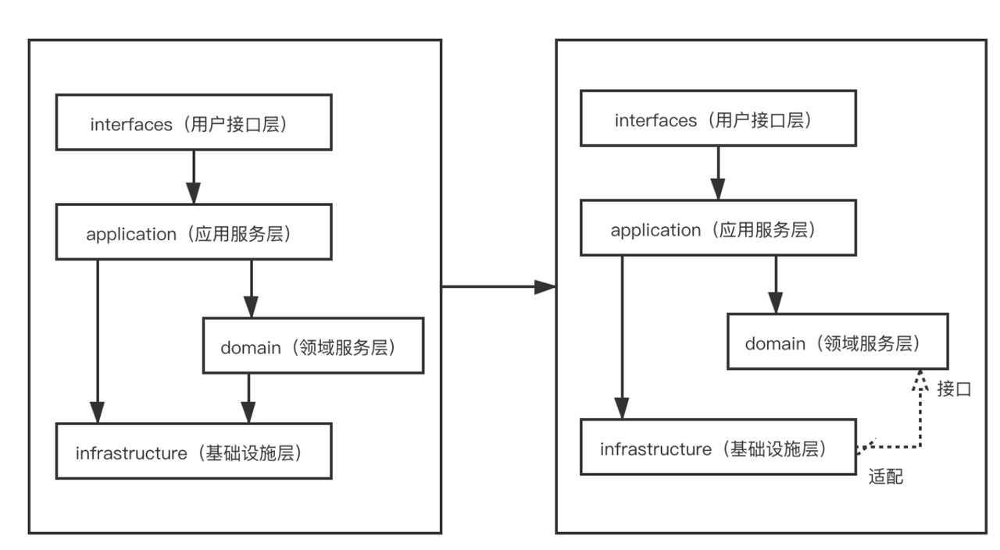

# DDD 四层架构设计文档

## 一、分层架构

### 1. 项目架构

采用 DDD 四层架构和 CQRS，各层职责分明，样例：

```
xxx                             //
├── xxx-admin                   // 管理后台接口
│   ├── facade                  //
│   └── vo                      // view object
│       ├── req                  //
│       └── resp                //
├── xxx-api                     // C端接口
│   ├── facade                  //
│   └── vo                      // view object
│       ├── req                 //
│       └── resp                //
├── xxx-common                  // 工具层
├── xxx-domain                  // 领域层
│   ├── repository              // 仓储接口
│   ├── service                 // 领域服务
│   └── model                   // 领域模型
│       ├── entity              // 实体
│       ├── vo                  // value object
│       ├── event               // 领域消息
│       └── aggregate           // 聚合根
├── xxx-infrastructure          // 基础设施层
│   ├── repository.impl         // 仓储实现
│   ├── persistence             // 持久化
│   │   └── po                  // Persistence Object
│   ├── assember                // po、防腐层与领域对象映射
│   ├── message                 // 消息组件
│   └── acl                     // 防腐层
│       ├── dto                 // 防腐层 dto
│       ├── rpc                 // 远程rpc
│       └── rest                // 远程rest
└── xxx-server                  // 服务层
    ├── config                  // 配置类
    ├── interfaces              // 接口层
    │   ├── rest                // REST接口
    │   └── facade.impl         // 接口实现
    └── application             // 应用层
        ├── service             // 应用服务
        │   ├── command         // CQRS
        │   └── query           // CQRS
        ├── assember            // DTO与领域对象映射
        └── dto                 // 数据传输对象 Data Transfer Object
```

### 2. 调用关系



### 3. 数据流转

- **interface 层**：request、response
- **application 层**：DTO（data transfer object）
- **domain 层**：entity，VO（value Object）
- **infrastructure 层**：PO（persist object）

## 二、Domain 层

### 1. Domain 范围

Domain 层主要包含领域模型（Domain Model），比如：

- **实体（Entity）**：有唯一标识的业务对象，如"订单"、"用户"。
- **值对象（Value Object）**：无唯一标识，仅通过属性值定义的对象，如"地址"、"金额"。
- **聚合根（Aggregate Root）**：实体的集合边界，保证数据一致性。
- **领域服务（Domain Service）**：当业务逻辑不适合放在某个实体上时，用领域服务封装。
- **领域事件（Domain Event）**：业务状态变化的事件。

不包含技术层相关的类（比如 DAO、DTO、Controller、ServiceImpl等）

### 2. Domain Model

#### 2.1 封装

- 拒绝 Getter、Setter、Constructor 等注解，DDD 强调通过代码表达领域模型的意图和业务规则。直接暴露 getter/setter，会让你的领域对象退化为一个贫血模型，只是一个数据容器，而不是业务的承载体，违背了封装的原则。
- 封装业务行为，才能形成真正的充血模型，逻辑内聚，模型可维护、可扩展，领域对象的方法必须具备明确的业务含义。

#### 2.2 依赖倒置



Domain 层不再直接依赖 Infrastructure 层，而是引入了一个适配器模式(Port/Adapter)，使用 DIP（Dependency Inversion Principle，依赖倒置）反转了 Domain 层和 Infrastructure 层的依赖关系，其关系如上图所示 Domain 层以接口的方式开放端口，让 Infrastructure 层去实现。

**优势：**
- ✅ 易于单元测试：构造纯对象即可测试，不依赖 Spring 环境。
- ✅ 解耦框架：更容易迁移、更少"技术污染"。
- ✅ 聚焦业务：领域对象只关心业务含义，职责清晰。

### 3. Domain Service

1. 领域方法太复杂或臃肿，可考虑将适当迁入到 domain service
2. 跨聚合根交互时，需要引入 domain service

例：订单售后需要订单聚合根、售后聚合根交互，可以抽到 domain service 进行业务处理

## 三、Infrastructure 层

### 1. 实现

Repository 是领域层的一部分，职责是"存取领域模型"，负责具体数据库、缓存、消息的实现。

### 2. 隔离

1. Repository 的入参和出参除了原始数据类型，只能包含领域对象，而不是直接处理 DTO（数据传输对象）或 PO（数据库实体对象）
2. 使用转换器（Assembler/Converter）在基础设施层完成对象转换

### 3. 防腐层 ACL

防腐层的作用是：

- 保护领域模型不被外部系统污染或侵蚀
- 实现外部系统模型 → 自己系统领域模型的隔离和转换
- 防止外部系统设计不佳、耦合度高、变化频繁影响你的系统

例如：商品数据需要在加购、下单时被使用到，它返回的接口数据结构是 ProductListResponse，但你不希望这个结构在你的领域模型里出现，这时你应该：

- 定义一个 ProductAdaptor 接口/实现
- 将外部数据结构 ProductListResponse 转换为你自己的领域模型 productIterm

## 四、Application 层

### 1. CQRS 读写分离

CQRS 的核心思想是：将"读操作"和"写操作"分离成两个服务接口，职责清晰，便于演进、扩展和性能优化。

#### 1.1 XXXCommandService

- 只包含"写"操作：新增、更新、删除、触发业务行为等
- 会调用 领域服务 / 聚合根
- 会有事务控制
- 会影响系统状态

#### 1.2 XXXQueryService

- 只包含"读"操作：查询详情、列表、分页等
- 不包含任何副作用
- 可返回 DTO/VO，不强依赖 domain model
- 可对接读库（或搜索引擎缓存等）

### 2. 转换器

1. 负责正向实现 vo（view object）-> dto（command/query）转换
2. 负责逆向实现 dto（command/query）-> vo（view object）转换
